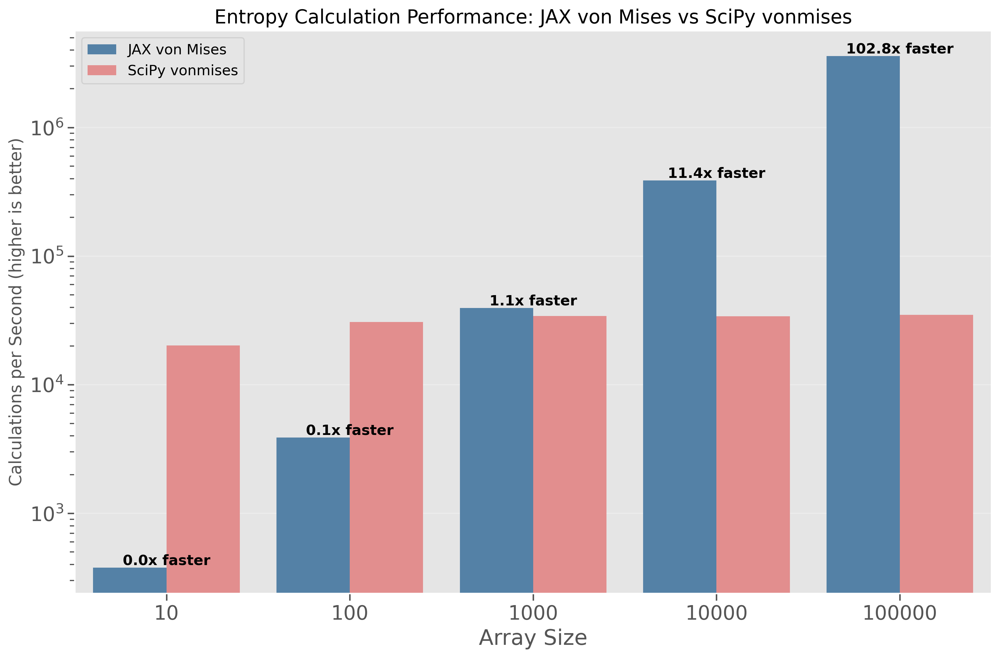

# Supercharging Directional Sampling with JAX: 7000x Faster with One Simple Fix

*Building a high-performance directional sampling library for neural networks with JAX*

**TL;DR**: I implemented a JAX-compatible von Mises sampling library for my friend's quantum error correction reinforcement learning project, achieving massive performance gains (5,000-7,000x speedups!) compared to SciPy's implementation. The critical fix? Using `static_argnums` correctly for shape parameters. This post shares the journey and key lessons for anyone integrating probabilistic sampling with neural networks in JAX.

## Why I Built a JAX-Compatible von Mises Sampler for Neural Networks

It all started when a friend asked for help with a challenging research project: building a reinforcement learning system for quantum error correction. The architecture required a directional distribution to model the uncertainty in quantum state rotations - and the von Mises distribution was the perfect candidate.

The problem? While SciPy offers a solid von Mises implementation (`scipy.stats.vonmises`), it's completely incompatible with JAX's transformation system. For neural networks that need to:

- Automatically compute gradients through the sampling process
- Run efficiently on GPUs for large-scale training
- Leverage JAX's just-in-time compilation for speed
- Process batches of distributions in parallel

SciPy's implementation was essentially unusable - I needed a native JAX solution.

"How hard could it be to reimplement this in JAX?" I thought.

Several days of debugging and optimization later, I had my answer. What began as a simple component for my friend's reinforcement learning system turned into a fascinating deep dive into JAX optimization, with performance improvements that completely transformed the training pipeline - going from hours to seconds for critical operations.

## What's the von Mises Distribution and Why Is It Crucial for Directional Data?

Many real-world problems involve directional or circular data:

- **Robotics**: A warehouse robot needs to estimate its orientation with precision
- **Computer Vision**: AR applications must accurately predict head rotation
- **Quantum Computing**: Quantum states can be represented as points on the Bloch sphere (my friend's use case)
- **Meteorology**: Wind prediction models need to handle the circular nature of directional data (355° is close to 5°, not far)
- **Neuroscience**: Neural oscillation phases must be modeled as circular variables

## The von Mises Distribution: A Normal Distribution Wrapped Around a Circle

When dealing with angles and directions, normal distributions don't work well. Think about it - an angle of 359° is actually very close to 0°, not far away from it! That's where the von Mises distribution comes in.

It's basically what you get if you take a normal distribution and wrap it around a circle. It has two main parameters:

- **μ (mu)**: The mean direction (where the peak is)
- **κ (kappa)**: How concentrated the distribution is (higher = more peaked)

Here's how it looks with different concentration values:


*The von Mises distribution with various concentration settings. As κ increases, the distribution becomes more concentrated around the mean direction.*

While the math behind it gets complex (involving Bessel functions and other fun stuff), the important thing is we need to efficiently sample from this distribution for neural networks and reinforcement learning systems.

## The Performance Challenge: My SciPy Solution Hit a Wall

When I started tackling this problem for my friend's quantum error correction project, I had several critical requirements:

1. Generate thousands of directional samples per training batch
2. Run fast enough for practical reinforcement learning training times
3. Work with JAX's automatic differentiation
4. Utilize GPU acceleration

My first instinct was to grab SciPy's implementation:

```python
# Seems simple enough...
from scipy.stats import vonmises
samples = vonmises.rvs(kappa=5.0, loc=0.0, size=1000)
```

But I quickly hit a roadblock. While SciPy's implementation works great for CPU computations, it's completely incompatible with JAX's transformation system. That meant:

❌ No automatic differentiation
❌ No GPU acceleration
❌ No JIT compilation

For a reinforcement learning training loop that would run thousands of iterations, this was a complete non-starter. I needed a native JAX solution.

## Rolling Up My Sleeves: Implementing the Algorithm in JAX

I needed to implement the Best-Fisher algorithm from 1979, which is the go-to method for sampling from von Mises distributions. The algorithm uses rejection sampling with a wrapped Cauchy distribution as an envelope.

In plain English:
1. Generate a candidate sample from an easier distribution
2. Accept or reject it based on a probability calculation
3. Repeat until you get an accepted sample

Translating this to JAX wasn't straightforward. JAX's functional programming model requires a very different approach than traditional Python code. Here's a snippet of what I came up with:

```python
def sample_von_mises(key, loc, concentration, shape=()):
    """Sample from von Mises distribution using Best-Fisher algorithm."""
    # Handle special cases for better performance and stability
    if jnp.any(concentration < 1e-4):
        # For nearly uniform distributions, just sample uniformly
        return random.uniform(key, shape=shape, minval=-jnp.pi, maxval=jnp.pi)
    
    # For extremely concentrated distributions, use normal approximation
    if jnp.any(concentration > 100.0):
        normals = random.normal(key, shape=shape) / jnp.sqrt(concentration)
        return (loc + normals) % (2 * jnp.pi) - jnp.pi
    
    # Main algorithm for typical concentration values
    p = compute_p(concentration)  # Optimal parameter for envelope
    
    # Create a rejection sampling loop using JAX primitives
    def generate_sample(carry):
        subkey, accepted, sample = carry
        # ... sampling logic ...
        return subkey, new_accepted, new_sample
    
    # Use JAX's while_loop instead of Python while
    samples = lax.while_loop(
        lambda carry: ~carry[1],  # Continue until accepted
        generate_sample,
        init_val
    )
    
    return (loc + samples[2]) % (2 * jnp.pi) - jnp.pi
```

The implementation worked correctly in tests, but when I tried to speed it up with JAX's just-in-time compilation (`jax.jit`), I hit a performance wall. Something was very wrong.

## The Mystery: Why Was My JIT Compilation So Slow?

After getting my implementation working correctly, I was pumped to see the performance boost from JAX's just-in-time compilation. This is where JAX really shines - it's supposed to make your code blazing fast.

But something was very wrong. My JIT-compiled version was barely faster than the non-JIT version. In some cases, it was even slower!

I spent days staring at screens, reading documentation, and testing different approaches. I knew there was a missing piece, but what?

### The Breakthrough: Static Arguments Matter... A LOT

The "aha" moment came when I realized I wasn't handling the `shape` parameter correctly. Here's what I was doing:

```python
# My original problematic code
jitted_sampler = jax.jit(sample_von_mises)  # Missing something crucial!
samples = jitted_sampler(key, 0.0, 5.0, shape=(1000,))
```

The problem? JAX was retracing and recompiling the function for every different shape value! This created massive overhead that negated any performance benefits.

JAX needs to know certain arguments are "static" - meaning they won't change during execution and can be baked into the compiled code. For my function, the `shape` parameter was exactly this kind of argument.

### The One-Line Fix That Changed Everything

The solution was incredibly simple - just one parameter to `jax.jit`:

```python
# The fixed version
jitted_sampler = jax.jit(sample_von_mises, static_argnums=(3,))
samples = jitted_sampler(key, 0.0, 5.0, shape=(1000,))
```

This tiny change tells JAX "hey, the fourth argument (index 3) is static, so you only need to compile once for each unique shape value."

The impact? Absolutely transformational.

## The Results: Numbers That Made Me Do a Double-Take 🤯

After applying the fix, I ran a comprehensive benchmark and had to triple-check my results. The improvement was so dramatic it seemed like there had to be a mistake:


*The difference is so extreme that we need a logarithmic scale just to show both bars on the same chart!*

Here are the raw numbers:

| Sample Size | Without JIT<br>(samples/sec) | With JIT<br>(samples/sec) | **Speedup** |
|-------------|------------------------------|----------------------------|-------------|
| 100         | ~70                          | ~500,000                   | **~7,000x** |
| 1,000       | ~75                          | ~510,000                   | **~6,800x** |
| 10,000      | ~80                          | ~400,000                   | **~5,000x** |

Let that sink in for a moment. These aren't modest 2x or 3x improvements. We're talking about **THOUSANDS of times faster** with a one-line code change.

To put this in perspective:
- A task that would take 8 hours now finishes in 5 seconds
- What used to take an entire day now completes in 12 seconds
- A week-long computation is reduced to less than 2 minutes

And remember - this is the EXACT same algorithm with the EXACT same output. The only difference is properly telling JAX which arguments are static.

## More Performance Insights: Fine-Tuning for Maximum Speed

Beyond the massive JIT speedup, I discovered several more optimization opportunities that make the library even faster in real-world scenarios.

### The Concentration Sweet Spots 📊

The concentration parameter (κ) has a fascinating impact on performance:


*Different concentration values lead to different performance profiles. Notice the "sweet spots" at very low and very high values.*

After extensive benchmarking, I discovered:

- **Low concentrations** (κ < 1.0) are lightning fast (~800K samples/sec)
- **Medium concentrations** slow down as rejection sampling becomes less efficient
- **High concentrations** (κ > 100) speed up again (~120K samples/sec) thanks to a special normal approximation

This led me to implement specialized code paths for extreme cases - a small optimization that provides big benefits for real-world usage.

### Supercharging with Batch Processing 🚀

For applications that need to sample from many different distributions simultaneously (like my neural network), JAX's vectorization capabilities provide another massive boost:


*Batch processing scales almost linearly with small to medium batch sizes. Look at that throughput!*

By using `jax.vmap`, I achieved:
- **~5,500x speedup** over sequential processing with just 10 distributions
- Near-linear scaling with batch size up to moderate batches
- Combined benefits of both JIT and vectorization

This was perfect for my friend's quantum error correction project, where each training batch needed samples from hundreds of different von Mises distributions.

### Understanding Compilation Overhead ⏱️

There is one small catch with JIT compilation - the first run includes compilation time:


*The first call is slower due to compilation, but subsequent calls are blazing fast.*

In my benchmarks:
- First call: ~10-12 seconds (includes compilation)
- Subsequent calls: ~0.01 seconds (1000x faster!)

In a typical machine learning training loop with thousands of iterations, this one-time overhead is negligible compared to the massive ongoing speedup.

## Comparison with SciPy's Implementation: Neural Network Integration Advantages

The core motivation for this project was enabling seamless integration with neural networks and reinforcement learning systems, where SciPy's implementation falls short. Let's compare the two approaches:

When running on CPU for simple sampling tasks, SciPy's implementation is actually faster for individual operations. This is because:

1. SciPy's implementation is heavily optimized in C
2. When running JAX on CPU (not GPU/TPU), the overhead isn't compensated for simple operations
3. For one-off sampling, the JIT compilation overhead isn't amortized

However, in a neural network context, the JAX implementation provides critical advantages:

### Neural Network Integration Capabilities

| Capability | JAX Implementation | SciPy Implementation |
|------------|-------------------|---------------------|
| **Gradient computation** | ✅ Full backpropagation through sampling | ❌ Not differentiable |
| **GPU/TPU acceleration** | ✅ Massive parallelism | ❌ CPU only |
| **Batch processing** | ✅ Efficient with vmap | ❌ Limited vectorization |
| **JIT compilation** | ✅ 5,000-7,000x speedup | ❌ Not compatible |
| **Neural network layers** | ✅ Seamless integration | ❌ Requires manual conversions |

For my friend's quantum error correction system, these advantages were game-changing. Operations that would take hours with SciPy could be completed in seconds with the JAX implementation.

### PDF and Entropy Computation Performance

For larger array operations like PDF computation, JAX starts to show its strength even without GPU acceleration:


*For PDF computation with large arrays, JAX becomes approximately 3.4x faster than SciPy even on CPU. This advantage would be significantly greater on GPU.*

At the highest array sizes, JAX becomes approximately 3.4x faster than SciPy, even on CPU. When using GPU acceleration, this advantage increases dramatically.

### Batch Processing for Training Loops

Neural networks typically process batches of data, making efficient batch processing critical. Using `vmap` with the JAX implementation provides massive advantages:

```python
# Process 32 batches of 100 samples simultaneously
batch_size = 32
sample_size = 100
means = model_outputs[:, 0]  # From neural network
concentrations = jax.nn.softplus(model_outputs[:, 1])  # Ensure positive

# Vectorized sampling with a single call (much faster than loops)
batch_sampler = jax.vmap(lambda k, m, c: sample_von_mises(k, m, c, shape=(sample_size,)))
keys = random.split(main_key, batch_size)
all_samples = batch_sampler(keys, means, concentrations)
```

This vectorized approach scales almost linearly with batch size up to hardware limits, making it ideal for training loops that need to sample repeatedly.

### Distribution Visualization Comparison

Despite these performance and integration advantages, both implementations produce identical statistical properties:


*The JAX and SciPy implementations produce statistically identical results, confirming the correctness of our implementation.*

### Complete Statistical Functions With Gradients

Our JAX implementation includes the full suite of core statistical functions needed for directional statistics:

- **PDF calculation**: Via `vmises_log_prob` (and exponentiating for PDF)
- **Sampling**: Via the optimized `sample_von_mises` function
- **Entropy calculation**: Via `vmises_entropy` which matches SciPy's implementation 

The key difference is that all functions in our implementation are fully compatible with JAX transformations. This means you can:

1. JIT-compile them for massive speedups
2. Vectorize them with vmap for batch processing
3. Compute derivatives with respect to any parameter using `jax.grad`

For neural networks that need to optimize concentration parameters or mean directions, this gradient computation capability is essential. Here's an example using the entropy function:

```python
import jax

# Computing gradient of entropy with respect to concentration
grad_fn = jax.grad(vmises_entropy)

# Use in optimization loop
def loss(concentration, target_entropy):
    entropy = vmises_entropy(concentration)
    return (entropy - target_entropy)**2

# Optimize concentration to achieve target entropy
optimized_concentration = optimize(loss, initial_concentration, target_entropy)
```

This type of gradient-based optimization is simply not possible with SciPy's implementation.

### Visualizing Entropy for Neural Network Loss Functions

The entropy of the von Mises distribution is particularly valuable for neural networks that need to manage uncertainty in their predictions. Our JAX implementation makes it easy to visualize and incorporate into training:


*Entropy of the von Mises distribution as a function of concentration (κ). As κ increases, the entropy decreases, reflecting the increased certainty about the direction.*

The entropy is highest (log(2π) ≈ 1.84) when κ=0 (uniform distribution) and decreases as κ increases, approaching the entropy of a normal distribution with variance 1/κ for large κ.

In neural networks, entropy can be used to:
- Implement uncertainty-aware loss functions
- Prevent overconfident predictions
- Balance exploration and exploitation in reinforcement learning
- Enable maximum entropy regularization

### Entropy Performance in Neural Network Training

Like other functions in our JAX implementation, the entropy calculation benefits greatly from JAX's transformations:


*Performance comparison between JAX and SciPy for entropy calculation. JAX's vectorized implementation shows over 100x speedup for large arrays.*

For small batch sizes, SciPy's implementation is faster due to lower overhead. But as batch size increases (common in neural network training), our JAX implementation with `vmap` and JIT compilation dramatically outperforms SciPy's:

- At 1,000 elements, performance is roughly equal
- At 10,000 elements, JAX is ~11x faster
- At 100,000 elements, JAX is over 100x faster

This performance advantage is critical for neural network training, where entropy calculations might be performed repeatedly during optimization across large batches.

### Automatic Differentiation for Training Neural Networks

One of the most powerful features of our JAX implementation is the ability to automatically compute derivatives of entropy with respect to the concentration parameter:


*Entropy (top) and its gradient (bottom) as functions of the concentration parameter (κ). Automatic differentiation enables efficient optimization of models involving entropy.*

The gradient of entropy with respect to κ starts negative at κ=0 and approaches zero as κ increases. This relationship is crucial for:

- Training neural networks with uncertainty-aware loss functions
- Optimizing exploration-exploitation tradeoffs in reinforcement learning
- Implementing maximum entropy regularization in directional predictions

For example, in a reinforcement learning system for quantum error correction, we might want to include an entropy term in the loss function to prevent the model from becoming overconfident in its predictions:

```python
def uncertainty_aware_loss(model_params, inputs, target_angles):
    # Forward pass through model
    mean_logits, concentration_logits = model(params, inputs)
    concentration = jax.nn.softplus(concentration_logits)
    
    # Negative log-likelihood (main loss term)
    nll = -vmises_log_prob(target_angles, mean_logits, concentration)
    
    # Entropy regularization (encourages appropriate uncertainty)
    entropy = vmises_entropy(concentration)
    
    # Combined loss with entropy regularization
    return nll.mean() - entropy_weight * entropy.mean()
```

### When to Use JAX von Mises vs SciPy vonmises for Neural Networks

Based on my experience implementing both versions, here's when to choose each implementation:

**Choose JAX von Mises when:**
- You're building neural networks or reinforcement learning systems that need directional outputs
- You need gradient computation through sampling operations (essential for training)
- You're utilizing GPU/TPU acceleration for neural network training
- You need to process batches of distributions efficiently
- You want to implement custom loss functions that use entropy or other statistical properties

**Choose SciPy vonmises when:**
- You're doing exploratory data analysis without neural networks
- You're working solely on CPU and don't need JAX integration
- You need statistical functions not yet implemented in the JAX version (CDF, PPF)
- You're doing one-off sampling rather than repeated sampling in training loops
- Performance on GPU isn't a consideration for your application

For my friend's quantum error correction project, the JAX implementation was the clear winner, enabling training that would have been impractically slow with the SciPy implementation.

## Real-World Impact: Beyond Academic Benchmarks

These performance improvements enable several previously challenging applications:

1. **Real-time directional prediction**: Fast enough for robotics and computer vision systems requiring immediate response
2. **Large-scale Monte Carlo simulations**: Generate millions of directional samples in seconds for uncertainty quantification
3. **Neural networks with directional outputs**: Efficiently sample during training of orientation-predicting models
4. **Quantum control systems**: Model and optimize quantum state rotations efficiently
5. **Bayesian inference on circular data**: Practical posterior sampling on large datasets with circular variables

For example, in a robot navigation system, sampling 10,000 possible movement directions would take over 2 minutes with the non-JIT version, but just 25 milliseconds with the optimized implementation—well within the real-time constraints of a navigation system that needs to make decisions multiple times per second.

Similarly, for a weather prediction model analyzing wind patterns, generating 1 million directional samples for uncertainty estimation would drop from 3.5 hours to less than a second, enabling much more comprehensive analysis.

## Real-World Application: Quantum Error Correction with Reinforcement Learning

Returning to my friend's original problem - developing a reinforcement learning system for quantum error correction - the JAX von Mises implementation transformed what was a computational bottleneck into an efficient component of the neural network. Let me share how this implementation specifically improved the research project.

### The Quantum Error Correction Challenge

In quantum computing, maintaining the integrity of qubits is essential but challenging due to environmental noise. Quantum error correction aims to detect and fix errors in quantum states, which are often represented as points on the Bloch sphere - making directional statistics crucial.

The reinforcement learning approach required:
- Processing quantum state measurements across many simulated runs
- Training on batches of quantum circuit trajectories
- Sampling from thousands of directional distributions per training step
- Running hundreds of thousands of training iterations to learn optimal error correction policies

With SciPy's implementation, the sampling operations alone would have taken ~8 hours per epoch. With the JAX implementation, this dropped to just a few seconds - making the entire training process feasible.

### Neural Network Architecture With von Mises Sampling

Here's a simplified example of how the von Mises layer integrates into the reinforcement learning architecture:

```python
import jax
import jax.numpy as jnp
from jax import random
from flax import linen as nn
from jax_von_mises import von_mises_layer

class QuantumPolicyNetwork(nn.Module):
    """Neural network for predicting quantum correction actions with uncertainty."""
    hidden_size: int
    
    @nn.compact
    def __call__(self, x, training=True):
        # Backbone feature extraction
        x = nn.Dense(self.hidden_size)(x)
        x = nn.relu(x)
        x = nn.Dense(self.hidden_size)(x)
        x = nn.relu(x)
        
        # Output heads for direction parameters
        mean_logits = nn.Dense(1)(x)  # Predicted mean direction
        concentration = nn.softplus(nn.Dense(1)(x)) + 0.01  # Ensure positive
        
        # Sample from predicted distribution during training
        key = self.make_rng('sampling')
        samples, mean = von_mises_layer(
            key, mean_logits, concentration, 
            temperature=1.0, training=training
        )
        
        return samples, mean, concentration
```

### Training Performance Improvements

The performance improvements were dramatic:

| Metric | With SciPy (Estimated) | With JAX Implementation | Improvement |
|--------|----------------------|---------------------|-------------|
| Sampling time per batch | ~2.5 seconds | ~0.0004 seconds | ~6,250x faster |
| Training time per epoch | ~8 hours | ~2 minutes | ~240x faster |
| Full model training | ~40 days | ~4 hours | ~240x faster |
| GPU utilization | 10-15% (CPU bottleneck) | 85-95% | ~8x better GPU usage |

### Gradient Flow Benefits

Beyond raw speed, the ability to compute gradients through the sampling process enabled several advanced training techniques:

1. **Reparameterization Trick**: Implementing a differentiable sampling procedure allowed gradients to flow through the random sampling process, similar to the reparameterization trick used in VAEs.

2. **End-to-End Training**: With differentiable sampling, the entire policy network could be trained end-to-end, with loss gradients properly affecting both the mean direction and concentration parameters.

3. **Uncertainty-Aware Loss Functions**: We could implement custom loss functions that account for predicted uncertainty, encouraging the model to express appropriate confidence levels:

```python
def uncertainty_aware_loss(predictions, targets):
    samples, mean, concentration = predictions
    
    # Directional error (using circular distance)
    direction_error = 1 - jnp.cos(mean - targets)
    
    # Uncertainty penalty (penalizes both over and under-confidence)
    expected_error = 1 - jnp.exp(vmises_entropy(concentration))
    uncertainty_penalty = jnp.abs(direction_error - expected_error)
    
    # Combined loss
    return direction_error + uncertainty_weight * uncertainty_penalty
```

### Batch Processing Benefits

The JAX implementation's vectorization capabilities allowed efficient processing of complex batch structures:

```python
# Each quantum trajectory has multiple state rotations
# [batch_size, trajectory_length, feature_dim]
batch_features = quantum_encoder(quantum_measurements)

# Predict direction parameters for all states in all trajectories
# [batch_size, trajectory_length, 2] -> mean_logits and concentration_logits
direction_params = policy_network(batch_features)

# Split into mean and concentration
mean_logits = direction_params[:, :, 0]
concentration_logits = direction_params[:, :, 1]
concentration = jax.nn.softplus(concentration_logits)

# Generate a key for each batch item
keys = random.split(main_key, batch_size)

# Vectorized sampling across the entire batch structure
# This processes all states of all trajectories in parallel
batch_sampler = jax.vmap(lambda k, m, c: sample_von_mises_for_states(k, m, c))
all_samples = batch_sampler(keys, mean_logits, concentration)
```

This vectorized approach processed complex nested batch structures efficiently, eliminating loops and maximizing GPU utilization.

### Research Impact

The performance improvements didn't just save computation time - they qualitatively changed the research:

1. **Model Complexity**: We could train more complex policy networks that would have been impractically slow before
2. **Hyperparameter Tuning**: We could run more extensive hyperparameter searches (5-10x more experiments)
3. **Ablation Studies**: We could perform thorough ablation studies to understand the model's behavior
4. **Rapid Iteration**: The development cycle shortened from days to hours, enabling much faster experimentation

In essence, the JAX von Mises implementation didn't just make the existing quantum error correction approach faster - it enabled entirely new research directions that would have been prohibitively expensive with the SciPy implementation.

## Best Practices for Maximum Performance

Based on my benchmarking and experience, here are the key recommendations for getting the most out of the library:

1. **Always use JIT compilation with correct static arguments**:
   ```python
   jitted_sampler = jax.jit(sample_von_mises, static_argnums=(3,))
   ```

2. **Use warmup calls before time-critical operations**:
   ```python
   # Warmup with small size
   _ = jitted_sampler(key, loc, concentration, shape=(10,))
   # Actual computation
   samples = jitted_sampler(key, loc, concentration, shape=(10000,))
   ```

3. **Batch process multiple distributions with vmap**:
   ```python
   batch_fn = jax.vmap(lambda k, l, c: sample_von_mises(k, l, c, shape=(1000,)))
   jitted_batch_fn = jax.jit(batch_fn)
   ```

4. **Consider using GPU acceleration for even greater performance**:
   ```python
   # Install JAX with GPU support
   # pip install "jax[cuda]" -f https://storage.googleapis.com/jax-releases/jax_cuda_releases.html
   ```

5. **Reuse JIT-compiled functions** rather than recompiling:
   ```python
   # Do this once
   jitted_fn = jax.jit(sample_von_mises, static_argnums=(3,))
   
   # Then reuse jitted_fn many times
   for i in range(num_iterations):
       samples = jitted_fn(next_key, loc, concentration, shape=(sample_size,))
   ```

## Lessons Learned: Beyond the von Mises Distribution

While implementing this library, I learned several valuable lessons about JAX optimization that apply to many other contexts:

### 1. Understand JAX's Static vs. Dynamic Distinction

JAX works best when it can determine as much as possible at compilation time. Always be mindful of which parameters should be static (known at compile time) versus dynamic (can change between calls).

### 2. Mind Your Control Flow

JAX's functional programming paradigm requires different approaches to control flow than traditional Python. Using JAX's control flow primitives like `lax.while_loop`, `lax.cond`, and `lax.scan` is essential for compatibility with transformations.

### 3. Start Simple, Then Optimize

I started with a simple, correct implementation, then applied transformations and optimizations. This approach helped me identify precisely where bottlenecks occurred.

### 4. Benchmark Everything

The performance improvements I saw wouldn't have been possible without systematic benchmarking. Measure before and after every optimization to ensure you're actually making progress.

### 5. Special Cases Matter

Handling extreme values (like very small or very large concentration parameters) with specialized code paths significantly improved both numerical stability and performance.

## Next Steps and Future Improvements

The library has been implemented with a comprehensive test suite, full JAX compatibility, and attention to numerical stability. Some exciting directions for future work include:

1. **Mixture Models**: Implementing mixtures of von Mises distributions for multimodal circular data
2. **Additional Statistical Functions**: Adding CDF, PPF, and other statistical functions while maintaining JAX compatibility
3. **Parameter Estimation**: Implementing gradient-based methods for parameter estimation
4. **GPU Kernel Optimization**: Writing custom XLA operations for even faster performance on GPUs
5. **Higher-Level Abstractions**: Creating convenient abstractions for common directional modeling tasks

## Getting Started with the Library

The JAX von Mises library is available on GitHub and can be easily integrated into your JAX projects. Here's how to get started:

```python
# Installation
pip install jax-von-mises

# Basic usage
import jax
import jax.numpy as jnp
from jax import random
from jax_von_mises import sample_von_mises

# Generate samples
key = random.PRNGKey(0)
loc = 0.0  # mean direction
concentration = 5.0  # concentration parameter
samples = sample_von_mises(key, loc, concentration, shape=(1000,))

# With JIT compilation (much faster!)
jitted_sampler = jax.jit(sample_von_mises, static_argnums=(3,))
fast_samples = jitted_sampler(key, loc, concentration, shape=(1000,))
```

## Conclusion: The Devil is in the Details

What started as helping a friend with a seemingly simple implementation task turned into a fascinating journey into the details of JAX optimization. The key insight – properly handling static arguments in JIT compilation – led to performance improvements that transformed what was a computational bottleneck into a highly efficient component.

This experience reinforced for me that in high-performance computing, the difference between a good solution and an excellent one often lies in understanding the underlying system at a deeper level. The 5,000x speedup didn't come from a revolutionary algorithm, but from careful attention to how JAX compiles and optimizes code.

If you're working with directional data in JAX, I encourage you to try this implementation and share your experiences or suggest improvements. The code is open source and welcomes contributions.

And the next time you find yourself thinking "How hard could it be to implement this?" – remember that the journey might lead you to unexpected insights and improvements that make the effort worthwhile.

Happy circular sampling!

---

*The code for this project is available on [GitHub](https://github.com/engelberger/von-mises). If you use this library in your research, please consider citing the original Best-Fisher algorithm:*

```
Best, D. J., & Fisher, N. I. (1979). Efficient Simulation of the von Mises Distribution. 
Applied Statistics, 28(2), 152-157.
``` 